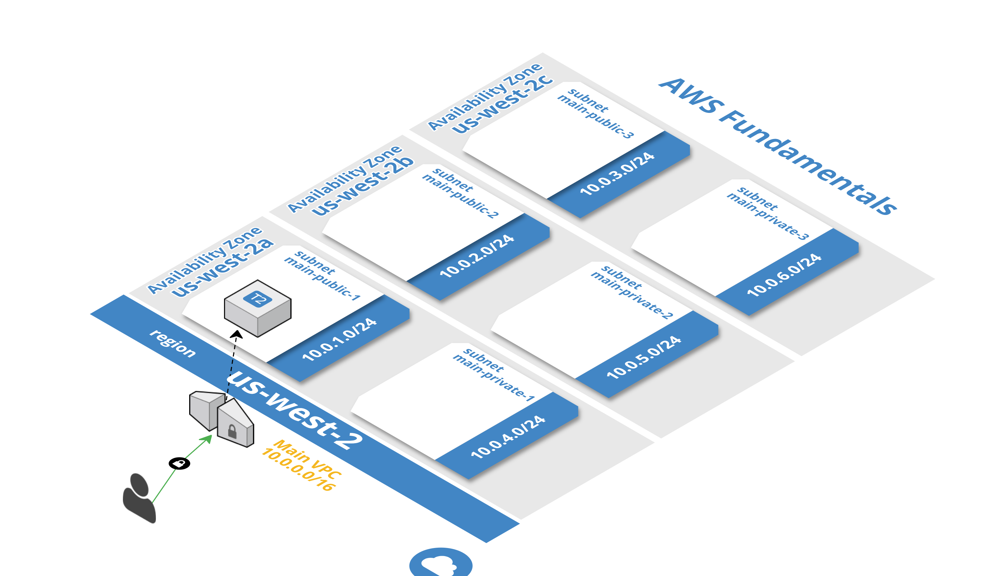

# AWS Fundamentals   





## Overview
This solution provides an example of deploying an EC2 Ubuntu instance to a custom VPC to AWS.  It uses Terraform to deploy an entire AWS VPC to the `us-west-2` region.

### Getting Started
First, you will need to have the following:
* AWS account and AWS CLI installed on your machine
* Terraform

Within the root of the solution directory, execute the following to see the Terraform Plan

```shell
terraform plan
```
To deploy the entire *Infrastructure as Code* to AWS, execute the following command

```shell
terraform apply

Apply complete! Resources: 16 added, 0 changed, 0 destroyed.

The state of your infrastructure has been saved to the path
below. This state is required to modify and destroy your
infrastructure, so keep it safe. To inspect the complete state
use the `terraform show` command.

State path:

Outputs:

elastic ip = 34.211.22.90
nginx_webserver_public_dns = [ ec2-35-160-20-59.us-west-2.compute.amazonaws.com ]
private ip address = 10.0.1.134

```

The output of the last command shows you the _EIP_ Elastic IP Address (public IP Address), which you can use to access the deployed website home page.
